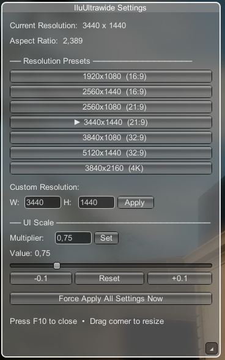
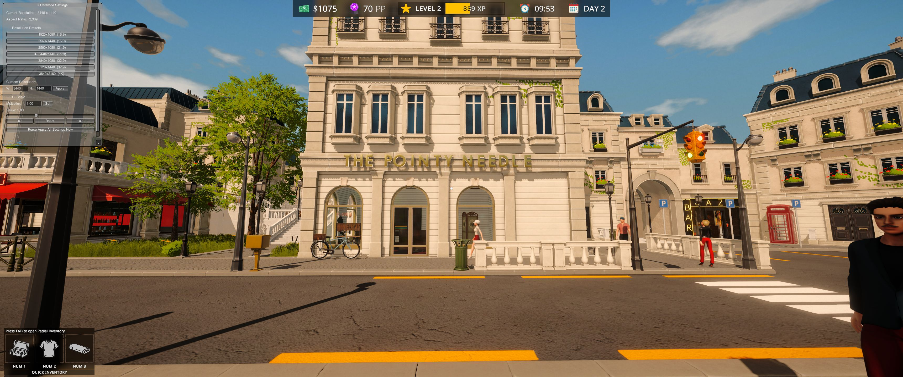
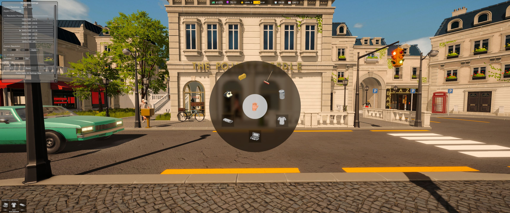

# IluUltrawide - Tailor Simulator Ultrawide Fix


WARNING! This is 100% vibe code. I'm not a programmer. But it works for me. Use at own risk. Thank Claude AI.






A BepInEx plugin that adds full ultrawide and custom resolution support to Tailor Simulator with live-adjustable settings.

## Features

✅ **Custom Resolution Support** - Play at 3440×1440, 5120×1440, or any resolution  
✅ **In-Game Settings Menu** - Press F10 for live-adjustable overlay  
✅ **UI Scaling** - Automatic + manual scaling prevents stretched UI  
✅ **Resolution Presets** - One-click common ultrawide resolutions  
✅ **Black Bar Removal** - Eliminates letterboxing and pillarboxing  
✅ **Aspect Ratio Fixes** - Proper UI element scaling for all aspect ratios

## Installation

### Prerequisites

**BepInEx 5.4.23+** (x64 version)
- Download: https://github.com/BepInEx/BepInEx/releases
- Extract to Tailor Simulator folder
- Run game once to generate folders

### Quick Install

1. Copy the `BepInEx` folder from this package
2. Paste into your Tailor Simulator game folder
3. Merge folders when prompted
4. Launch game and press **F10** to configure

See `INSTALL.txt` for detailed instructions.

## Usage

### In-Game Settings (F10)

Press **F10** to open the settings overlay:

**Resolution Presets:**
- 1920×1080 (16:9)
- 2560×1440 (16:9)
- 2560×1080 (21:9)
- **3440×1440 (21:9)** ← Default
- 3840×1080 (32:9)
- 5120×1440 (32:9)
- 3840×2160 (4K)

**Custom Resolution:**
- Enter Width and Height manually
- Click "Apply" for instant change

**UI Scale:**
- Slider or text input (0.25 - 2.5)
- 1.0 = Automatic for your aspect ratio
- Recommended: 0.7 - 1.2

**Force Apply:**
- Reapplies all settings immediately

### Configuration File

Persistent settings saved to:
```
BepInEx/config/IluUltrawide.cfg
```

Edit to change:
- Default resolution
- UI scale multiplier
- F10 keybind
- Enable/disable features

## Troubleshooting

| Issue | Solution |
|-------|----------|
| Plugin not loading | Check folder: `BepInEx/plugins/IluUltrawide/IluUltrawide.dll` |
| UI too small/large | Press F10, adjust UI Scale slider |
| F10 doesn't work | Edit config file, change ToggleKey |
| Resolution not applying | Use F10 menu instead of in-game settings |
| Black bars visible | Enable RemoveBlackBars in config, click Force Apply |

**Log File:** `BepInEx/LogOutput.log` - check for errors

## Building from Source

See `Source/BUILD.md` for complete build instructions.

**Quick Build:**
1. Copy game DLLs to `Source/lib/` (see `Source/lib/README.txt`)
2. Run: `dotnet build -c Release` in `Source/` folder
3. Output: `Source/bin/Release/netstandard2.1/IluUltrawide.dll`

## Technical Details

- **Framework:** netstandard 2.1
- **Dependencies:** BepInEx 5.4.23+, Harmony
- **Target Game:** Tailor Simulator (Unity 2022.3.46)
- **Features:**
  - Resolution enforcement via Harmony patches
  - UI CanvasScaler overrides
  - AspectRatioFitter patches
  - Camera viewport adjustments
  - IMGUI settings overlay

## Files Structure

```
IluUltrawide/
├── INSTALL.txt                    # Installation guide
├── README.md                      # This file
├── BepInEx/
│   └── plugins/
│       └── IluUltrawide/
│           └── IluUltrawide.dll   # Compiled plugin
└── Source/
    ├── BUILD.md                   # Build instructions
    ├── Plugin.cs                  # Main source code
    ├── MyPluginInfo.cs            # Plugin metadata
    ├── IluUltrawide.csproj        # Project file
    └── lib/
        └── README.txt             # DLL requirements
```

## Changelog

### v1.0.0 (2026-02-15)
- Initial release
- Ultrawide resolution support (21:9, 32:9, custom)
- In-game settings overlay (F10)
- UI scaling with live adjustment
- Resolution presets + custom input
- Black bar removal
- Aspect ratio fitter patches

## Credits

- **Author:** Iluvatar
- **BepInEx:** https://github.com/BepInEx/BepInEx
- **Harmony:** https://github.com/pardeike/Harmony

## License

Provided as-is for personal use. Source code included for educational purposes and modification.

## Support

For issues, check `BepInEx/LogOutput.log` for error details.
